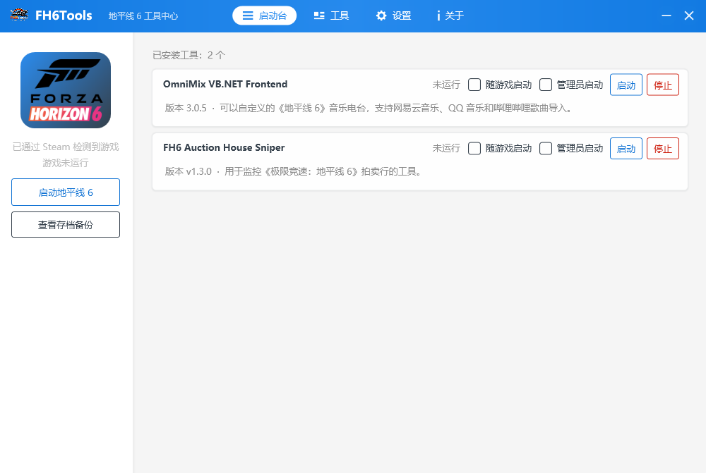
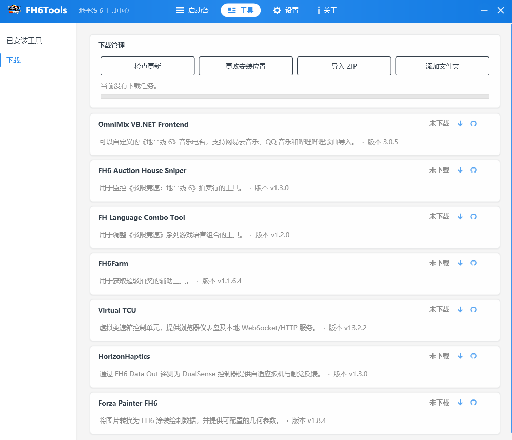
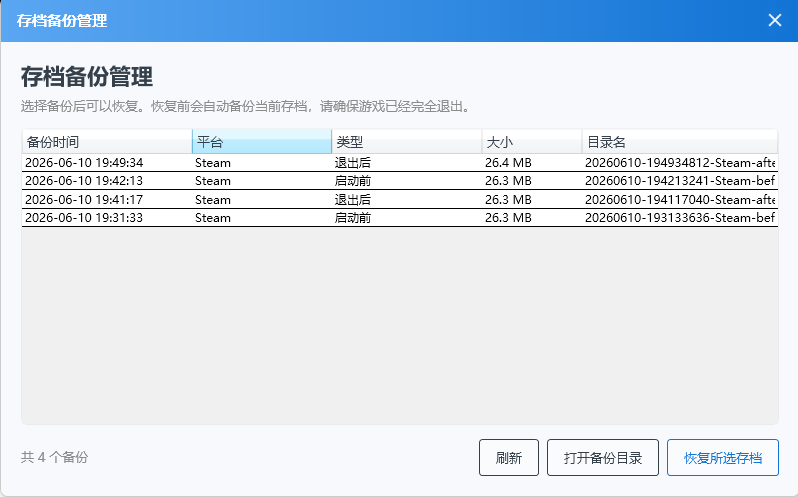

# FH6Tools

FH6Tools 是面向《Forza Horizon 6》的 Windows 桌面启动器与社区工具管理中心。它用于统一启动游戏、下载和管理工具、查看运行状态，并自动备份本地游戏存档。

> 本项目是非官方社区项目，与 Microsoft、Xbox、Playground Games、Turn 10 Studios 或 Forza 官方无隶属关系。

## 主要功能

- 启动《Forza Horizon 6》，并可让已安装工具随游戏启动。

- 从独立远程元数据清单新增和更新工具，下载、安装、更新和卸载社区工具。

- 自动备份游戏存档，并通过独立窗口查看和恢复历史备份。


## 提供的工具

FH6Tools 当前远程工具清单提供以下 8 个社区工具。软件启动时会动态更新工具列表，并检查工具版本与下载状态。
注意，工具下载需要有效的Github连接。

| 工具 | 简介 | 项目地址 |
| --- | --- | --- |
| OmniMix VB.NET Frontend | 可以自定义的《极限竞速：地平线 6》音乐电台，支持网易云音乐、QQ 音乐和哔哩哔哩歌曲导入。 | [Dr-hydra/OmniMix-VBNet-Frontend](https://github.com/Dr-hydra/OmniMix-VBNet-Frontend) |
| FH6 Auction House Sniper | 用于监控《极限竞速：地平线 6》拍卖行的工具。 | [Dr-hydra/FH6-Auction-House-Sniper](https://github.com/Dr-hydra/FH6-Auction-House-Sniper) |
| FH Language Combo Tool | 用于调整《极限竞速》系列游戏语言组合的工具。 | [Dr-hydra/FH-Language-Combo-Tool](https://github.com/Dr-hydra/FH-Language-Combo-Tool) |
| FH6Farm | 用于获取超级抽奖的辅助工具。 | [Dr-hydra/FH6Farm](https://github.com/Dr-hydra/FH6Farm) |
| FH6 Road Scanner | 通过逐行扫描地图帮助定位遗漏道路。 | [Dr-hydra/FH6-Road-Scanner](https://github.com/Dr-hydra/FH6-Road-Scanner) |
| Virtual TCU | 虚拟变速箱控制单元，提供浏览器仪表盘及本地 WebSocket/HTTP 服务。 | [Forza-Love/fh6-virtual_tcu](https://github.com/Forza-Love/fh6-virtual_tcu) |
| HorizonHaptics | 通过 FH6 Data Out 遥测为 DualSense 控制器提供自适应扳机与触觉反馈。 | [haritha99ch/HorizonHaptics](https://github.com/haritha99ch/HorizonHaptics) |
| Forza Painter FH6 | 将图片转换为《极限竞速：地平线 6》涂装绘制数据，并提供可配置的几何参数。 | [bvzrays/forza-painter-fh6](https://github.com/bvzrays/forza-painter-fh6) |

## 存档备份

FH6Tools 根据检测到的游戏版本使用固定存档路径：

| 游戏版本 | 存档路径 |
| --- | --- |
| Microsoft Store / Xbox / Steam | `C:\XboxGames\GameSave\pgs` |

根据反馈所有的版本存档路径是相同的。
已知简单拷贝本地存档仍会被云端存档覆盖，遇到问题的暂时可以先前往b站寻找解决方案，保留好备份存档。

自动备份时机：

- 启动游戏前创建一次备份，保留最近 3 份。
- 检测到游戏退出，并且存档目录连续 60 秒没有变化后创建备份，保留最近 10 份。
- 恢复历史存档前，自动为当前存档创建一份保护备份。

备份保存在：

```text
FH6ToolsData\game-save-backups
```

恢复存档前必须完全退出游戏。Xbox 云存档仍可能在之后覆盖本地存档，恢复操作需要由用户自行确认和处理云同步冲突。

## 运行与发布

开发环境需要：

- Windows 10/11 x64
- .NET 10 SDK

编译：

```powershell
dotnet build .\FH6Tools.slnx -c Release
```

生成包含共享运行时的发布版本：

```powershell
.\scripts\Publish-FH6Tools.ps1
```

发布结果位于：

```text
artifacts\publish\win-x64
```

发布脚本会在应用旁的 `dotnet` 目录中集成 .NET 10 Desktop Runtime 和 ASP.NET Core Runtime。FH6Tools 与由其启动的托管程序共享该运行时。

## 工具列表

候选工具来源记录在 [tools.md](tools.md)。独立远程清单可以新增工具，并同步项目地址、名称和中英简介。远程新增工具仅接受 GitHub 项目地址，并使用固定的普通权限、普通风险、单进程启动默认值；现有工具的下载方式、启动方式、管理员要求与风险等级仍由软件内置清单控制。FH6Tools 也允许用户添加本地工具。
想要添加工具欢迎提交issue。或者你可以自行导入。

## 交流与反馈

QQ 交流群：`851586605`

## 升级说明

v1.2.1 将 Microsoft Store、Xbox 和 Steam 版本的游戏存档路径统一为 `C:\XboxGames\GameSave\pgs`，并更新当前提供的工具列表。

## 数据目录

FH6Tools 默认将运行数据保存在 `FH6ToolsData`：

```text
FH6ToolsData\
├─ downloads\
├─ game-save-backups\
├─ tools\
└─ tool-state.json
```

## 许可证

FH6Tools 采用 [GNU General Public License v3.0](LICENSE) 开源。

你可以在 GPLv3 条款下使用、修改和分发本项目。分发修改版本时必须提供对应源代码，并继续采用兼容的 GPLv3 许可证。

## 与 PCL 的关系说明

FH6Tools 的部分 UI 设计与 UI 基础代码来源于或参考了 [Meloong-Git/PCL](https://github.com/Meloong-Git/PCL) 及其衍生项目，并根据相应开源许可证进行使用。

除相关 UI 部分外，FH6Tools 的业务功能、工具管理、下载、游戏启动及存档备份等功能均为独立实现。FH6Tools 与 PCL 官方及其维护者不存在从属、合作、官方授权或维护关系。

PCL 项目及其名称、代码和相关权利归原作者及贡献者所有。
